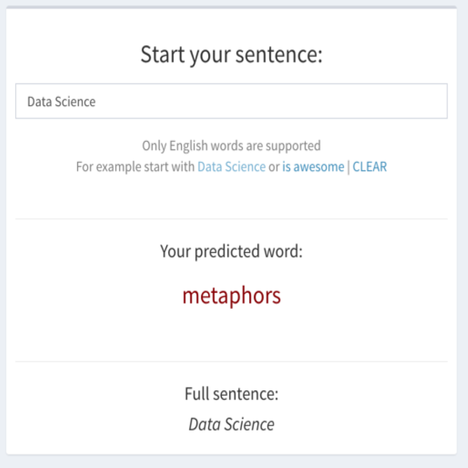

```{r setup, include=FALSE}
knitr::opts_chunk$set(echo = F, warning = F)
```

## Capstone objectives

The main objective was to develop and deploy a Shiny app that is able to do seamless word prediction, real-time.

The data for this project came from Swiftkey and for deployed app parts of **news** and **twitter** datasets were used.

Final deployment consists of 2 versions: one as per course specifications and other with more user-friendly response of three predicted words and a way to build naturally a full sentences.

## Methodology

For each set of words last three words are used:  
  - Prior to prediction, preparation of 2-gram, 3-gram and 4-gram datasets is done  
  - Cleaning of input data is done to prepare input the same way training dataset is cleaned (profanity, stopwords, various artifacts...)  
  - First, 4-gram data is looked up for match of all three words  
  - If no match is found, 3-gram and eventually 2-gram is looked up  
  

## Capstone version

```{r, out.width = "500px"}

```

## Optimized UX version

```{r, out.width = "500px"}

```

## Deployment

App is deployed as R Shiny app on:  
https://duxan.shinyapps.io/DS_capstone  

This presentation's original location:
http://rpubs.com/duxan/DS_capstone
